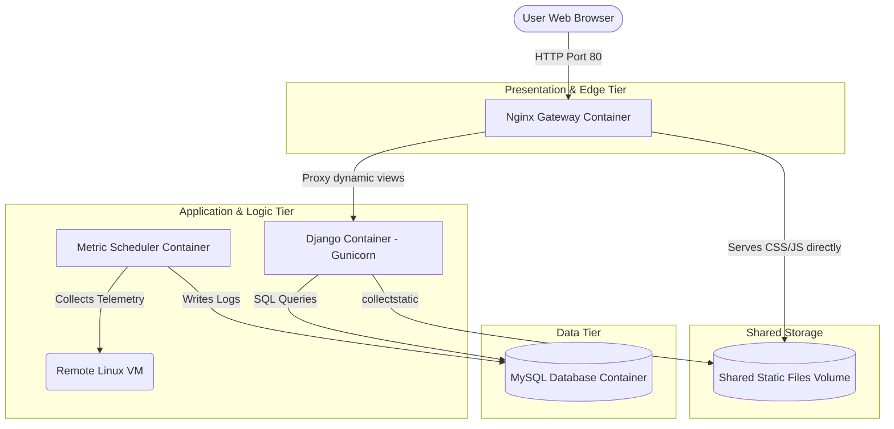

# Infratech - A production ready 3-tier monitoring system

Infratech is a containerized, production-ready system monitoring platform. It connects to a target remote Linux server via SSH at regular intervals, gathers telemetry data (CPU, RAM, Disk usage, and Uptime), processes analytics, and displays performance history on a premium dark-themed dashboard.

This project is deployed as a secure **Three-Tier Architecture** using **Docker Compose**, utilizing **Nginx** as a reverse proxy, **Gunicorn + Django** as the application server, and **MySQL** as the relational datastore.



---

## Architectural Breakdown

1.  **Presentation Tier (Nginx):** 
    Runs `nginx:alpine` on port `80`. It intercepts incoming requests, serves static CSS/JS files directly from a shared Docker volume (offloading static serving from Python), and reverse-proxies dynamic requests back to Gunicorn.
2.  **Application Tier (Django & Gunicorn):**
    Django backend logic and background metrics scheduler. Django runs on a production WSGI HTTP server (`gunicorn`) bound internally on port `8000`. The scheduler daemon polls target metrics over SSH via Paramiko.
3.  **Data Tier (MySQL):**
    Relational MySQL database persisting historical metrics telemetry. Port `3306` is bound with volume storage to prevent data loss on container rebuilds.

---

## Setup Guide (For Running on Your Laptop)

### Prerequisites
1.  **Docker & Docker Compose** installed on your laptop.
2.  A **Target Linux Server** (AWS EC2, Azure VM, DigitalOcean Droplet, Raspberry Pi, etc.) running SSH.
3.  **SSH Key Access:** An SSH private key (`.pem` file) configured on your laptop that has access to your server.

### Step 1: Place Your SSH Key
Put your private key file (e.g., `my_server_key.pem`) into the [ssh_keys/](file:///d:/Coding/infra-monitoring-platform/ssh_keys) directory in this project.

### Step 2: Configure Environment Variables
Copy the template environment file to create your own configuration:
```bash
cp .env.example .env
```
Open the newly created [.env](file:///d:/Coding/infra-monitoring-platform/.env) file and customize the variables for your target server:
```env
SSH_VM_HOST=your_server_ip_or_domain
SSH_VM_USERNAME=your_ssh_username
SSH_VM_KEY_NAME=your_pem_file_name_inside_ssh_keys_folder
```

### Step 3: Launch the 3-Tier Stack
Deploy the application with Docker Compose:
```bash
docker compose up --build
```
This automatically:
1.  Waits for the MySQL database to boot and completes schema migrations.
2.  Runs Django's asset compiler `collectstatic` to populate the shared volume.
3.  Starts the Gunicorn web app server.
4.  Launches Nginx to serve requests on [http://localhost:8080](http://localhost:8080/).
5.  Starts the scheduler to fetch remote metrics every 60 seconds.


My objective for this project was to learn docker and containerization, and deploy a 3-tier architecture on a remote server. I'll add multiple VM management, improved UI and alert mechanism in future.
